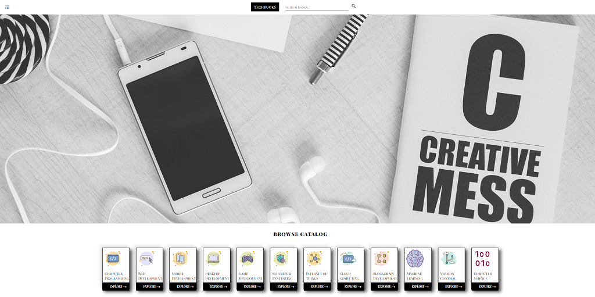
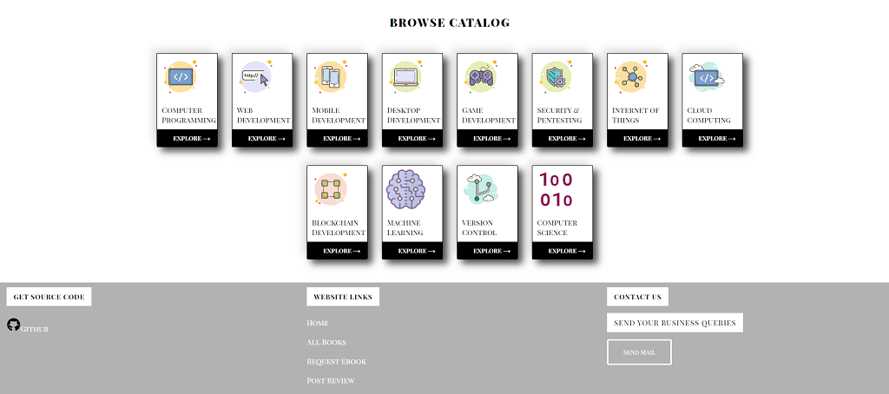
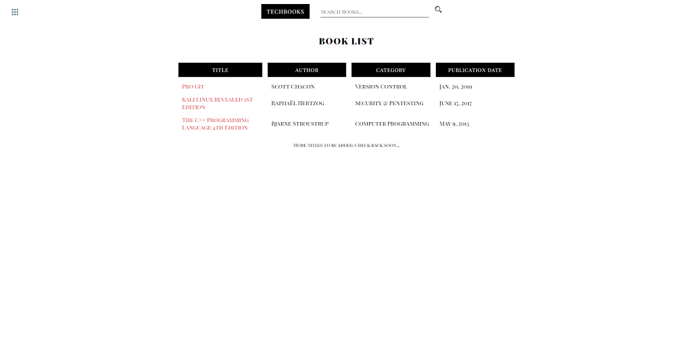
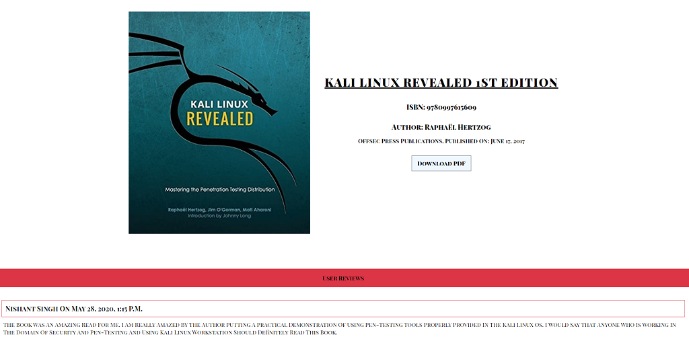
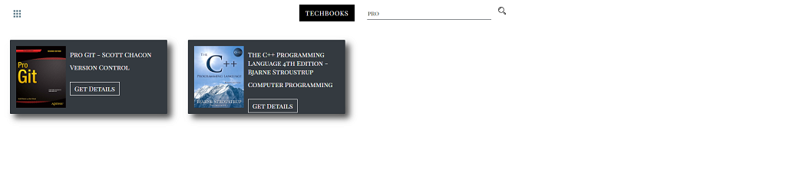
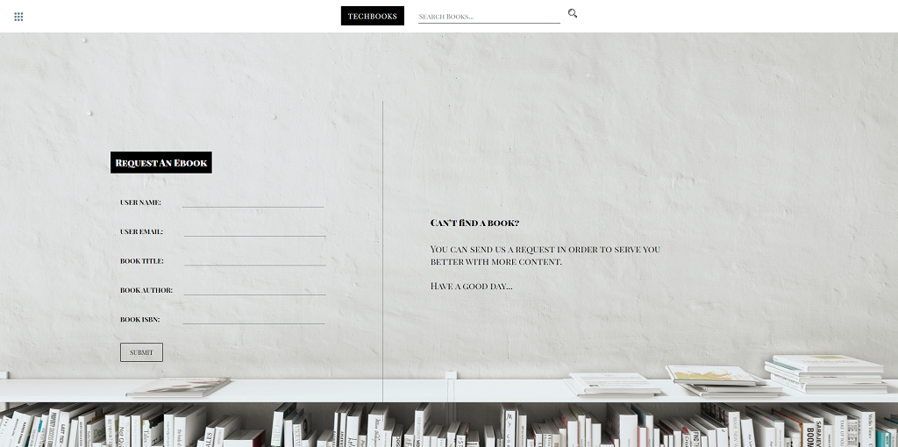
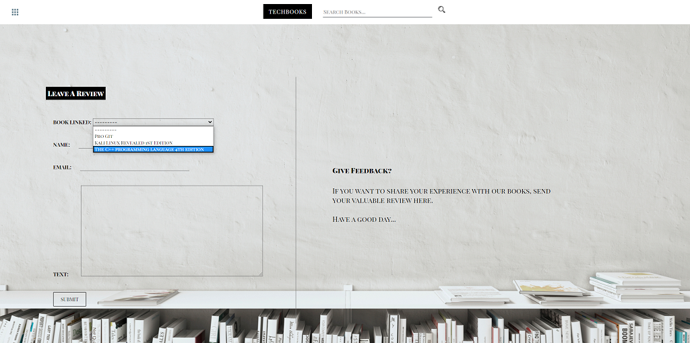

# TechBooks
Free E-Book distribution website built on top of Python, Django(MVT) framework, HTML, CSS, SQLite.

### Features
1. Responsive Design
2. Dynamic Search
3. Admin Dashboard at route `/admin`
4. Request E-Book to add to catalog
5. Post Book Review
6. Proper form spam handling, CSRF, validation and XSS protection
7. E-Book download option in PDF.
8. End-to End tested and ready for production.

> To run this project read [Run Locally](run_locally.md)

### Screenshots

